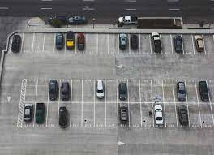

# Car Parking Detection using Python

## Introduction

This project focuses on implementing a car parking detection system using Python. The primary goal is to develop a solution that can identify and monitor the occupancy status of parking spaces. This can be particularly useful for managing parking spaces efficiently and providing real-time information to users.

## Sample Images


## Features

1. **Car Detection:** The system employs computer vision techniques to detect the presence of cars within a given parking area.

2. **Occupancy Status:** The program determines whether a parking space is occupied or vacant based on the car detection results.

3. **Real-time Monitoring:** The system provides real-time updates on the status of each parking space, allowing users to access the information easily.

4. **User Interface:** A simple and user-friendly interface is included to visualize the parking status and make it accessible to users.

## Requirements

- Python 3.x
- OpenCV
- NumPy
- Any additional dependencies specified in the project documentation

## Installation

1. Clone the repository to your local machine:

   ```bash
   git clone https://github.com/your_username/car-parking-detection.git
   ```

2. Install the required dependencies:

   ```bash
   pip install -r requirements.txt
   ```

## Usage

1. Navigate to the project directory:

   ```bash
   cd car-parking-detection
   ```

2. Run the main script:

   ```bash
   python parking_detection.py
   ```

3. Access the real-time parking status through the provided user interface.

## Contributing

If you'd like to contribute to the project, please follow the guidelines outlined in the [CONTRIBUTING.md](CONTRIBUTING.md) file.

## License

This project is licensed under the MIT License - see the [LICENSE.md](LICENSE.md) file for details.

## Acknowledgments

- Special thanks to [contributors](CONTRIBUTORS.md) who participated in this project.

Feel free to customize this README file based on your project specifics and requirements.

# 🌐 Contact Through: 
<p align="left">
  <a href="https://www.facebook.com/ruban.swe.3" target="blank"></a>
  <a href="https://www.linkedin.com/in/karthik-pp-b80b38237/" target="blank"></a>
  <a href="https://www.instagram.com/ig_._karthik/" target="blank"></a>
  <a href="https://instagram.com/ig_._karthik" target="blank"></a>
  <a href="https://www.youtube.com/@KARTHIK4332" target="blank"></a>
</p>
